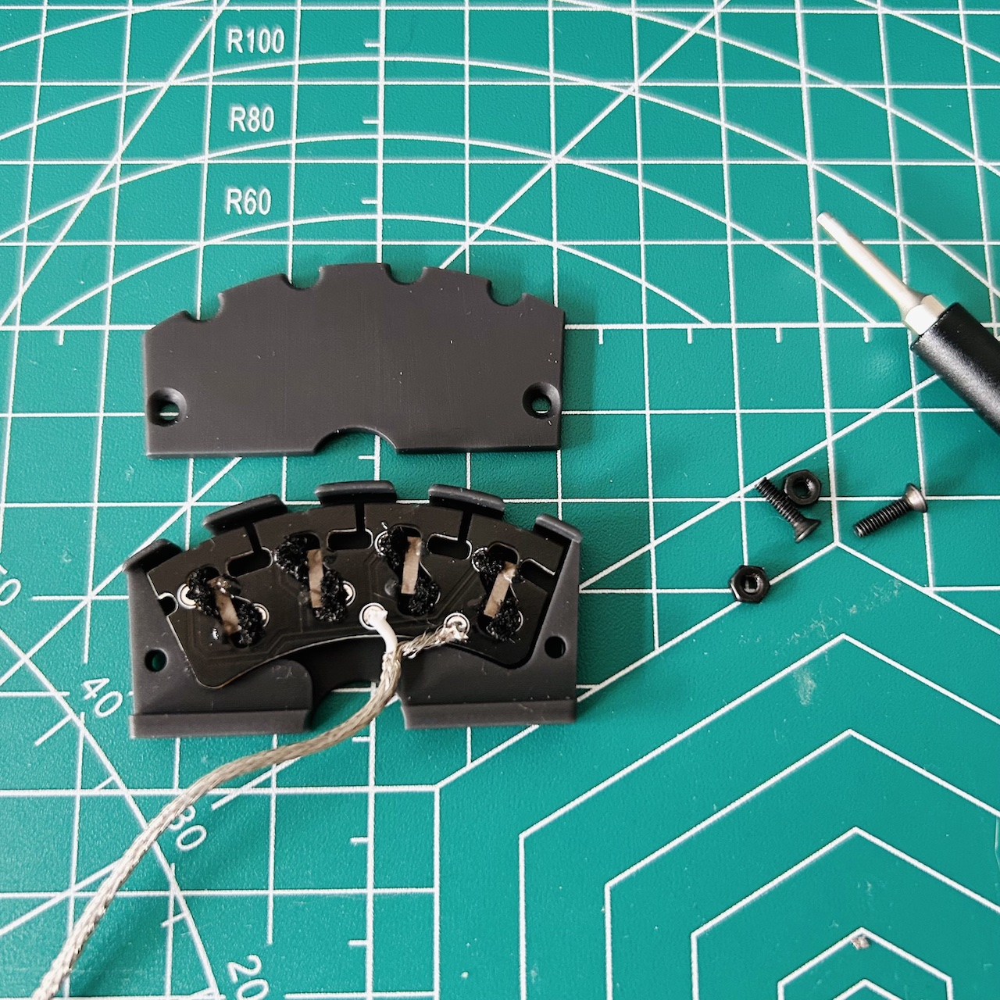
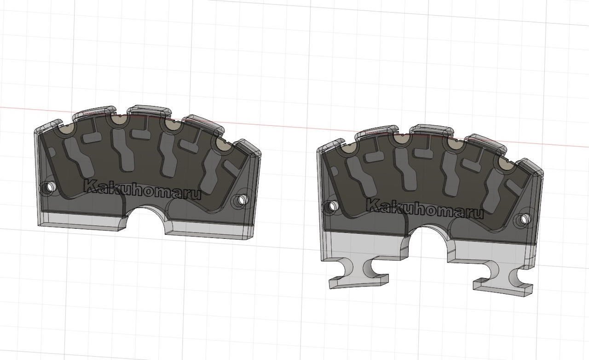

# The Kakuhomaru Bridge Pickup for Electric Violins 


The Kakuhomaru (角宝丸) bridge is a piezoelectric pickup for electric violins, designed with a ‘one-sensor-per-string’ approach to capture each note with clarity and richness.

🔊 Listen to the open string sample here:

https://github.com/penk/Kakuhomaru-bridge/assets/61878/6f59927d-60b6-4801-80bd-5c879a68bae8

## Bill of materials  


Each Kakuhomaru bridge is composed of 4 main parts:

1. Piezoelectric rods and shielded cable (repurposed from guitar undersaddle pickups).
2. 3D printable case (available in both [low profile](./case/kakuhomaru-case-lowp.stl) and [high profile](./case/kakuhomaru-case-highp.stl)).
3. Custom printed circuit board (PCB) with castellated holes.
4. Semi-rigid electronically conductive foam (I'm using [this one](https://www.distrelec.de/en/conductive-foam-305x305x6mm-rnd-rnd-600-00067/p/30130228) which has a `30 ohm-meter (Ω·m)` volume resistance).

While some parts may require a few days of lead time, the assembly is straightforward and DIY-friendly once all components are in hand.

## Ordering the PCB

To get started with your PCB order, upload the [production file](./production/kakuhomaru-bridge-gerbers.zip) to your preferred PCB manufacturer, such as JLCPCB or PCBWay. Ensure you select `Castellated Holes`—essential for the functionality of our bridge pickup.

Here are the specifications I used for our prototype:

```
PCB Thickness: 1.6 mm 
PCB Color: Black
Remove Order Number: Yes
Castellated Holes: Yes
Edges: 2
```

For reference, ordering 10pcs from JLCPCB cost approximately $40. This should help you budget for your build.

## Assembly Instructions 

- Step 1: Attach the Piezoelectric Rods

    Carefully slice open the heat shrink tubing of the under-saddle pickup with a utility knife to retrieve the piezoelectric ceramics. Position the ceramics with the positive end towards the  E string (treble side) and the marked negative end towards the G string (bass side) . Fix them in place on the PCB using a tiny drop of CA glue at each end.

    

- Step 2: Solder the Shielded Cable & Insert the Conductive Foam

    Strip back a small portion of the shielded cable to expose the central positive wire. Solder this wire to the positive through-hole on the PCB. Attach the braided mesh, which acts as the negative wire, to the `GND` (ground) through-hole. Then, insert conductive foam into the eight castellated holes, using approximately 5mm cubic pieces.

    

- Step 3: Close the Protective Case  

    Place the PCB assmebly inside the [3D printed case](./case/) and secure it with two M2x10 screws. 

    

🔊 Test the bridge assembly with an amplifier once you complete the assembly to ensure proper functionality.

https://github.com/penk/Kakuhomaru-bridge/assets/61878/055f79b9-ad49-477b-b956-cf757c91dd27

## Setting up 


- Shielding: There's no need for copper shielding tape due to the PCB's integrated ground plane, which reduces interference.
- Grounding: Establish a grounding connection by connecting the shielded cable to the tuning pegs (if applicable) or directly to the string ends, depending on your violin setup.
- Bridge Shaping: Sand the bridge feet as you normally would and use a pencil to mark the grooves on the edge of the PCB for smooth string sliding.

## Further Customization



For those looking to tailor the bridge pickup to different sizes or heights, an [editable STEP file](./case/kakuhomaru-case.step) is available. This file allows you to make precise adjustments to the bridge to perfectly fit your instrument's unique specifications.

Additionally, if your setup requires a pickup for five or more strings, you can take advantage of the [fully editable KiCad project](./kicad). This project includes a [DXF outline](./case/kakuhomaru-PCB-outline.dxf), enabling you to design and customize your PCB to accommodate the specific needs of multi-string electric violins.

## Copyright and License
Copyright (c) 2024 Penk Chen. All rights reserved.

All files are licensed under MIT license, see the [LICENSE](LICENSE) for more information.
