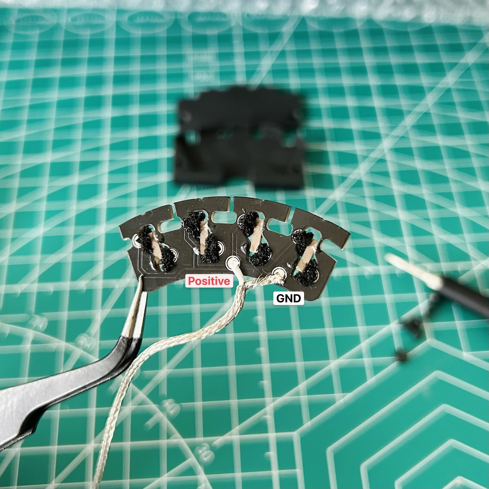

# The Kakuhomaru Bridge Pickup for Electric Violins 


The Kakuhomaru (角宝丸) bridge is a piezoelectric pickup for electric violins, featuring a ‘one-sensor-per-string’ design that ensures each note is captured with clarity and richness.

Listen to the open string sample here:

https://github.com/penk/Kakuhomaru-bridge/assets/61878/6f59927d-60b6-4801-80bd-5c879a68bae8

## Bill of materials  


Each Kakuhomaru bridge is composed of 4 main parts:

1. Piezoelectric rods and shielded cable (repurposed from a guitar under-saddle pickup).
2. Custom printed circuit board (PCB) with castellated holes.
3. Semi-rigid electronically conductive foam (I'm using [this one](https://www.distrelec.de/en/conductive-foam-305x305x6mm-rnd-rnd-600-00067/p/30130228) which has a `30 Ohm m` volume resistance).
4. 3D printable case (available in both [low profile](./case/kakuhomaru-case-lowp.stl) and [high profile](./case/kakuhomaru-case-highp.stl)). 

While some parts may require a few days of lead time, the assembly is straightforward and DIY-friendly once all components are in hand.

## Ordering the PCB

To get started with your custom PCB, upload the [production file](./production/kakuhomaru-bridge-gerbers.zip) to the PCB manufacturer of your choice, such as JLCPCB or PCBWay. Please ensure you select the option for `Castellated Holes` — this is vital for the functionality of our bridge pickup.

Below are the settings I have used for this prototype: 

```
PCB Thickness: 1.6 mm 
PCB Color: Black
Remove Order Number: Yes
Castellated Holes: Yes
Edges: 2
```

For reference, I ordered the PCB from JLCPCB: a batch of 5pcs cost approximately $40. This information should help you estimate the budget for your own build.

## Assembly Instructions 

- Step 1: Glue the Piezoelectric Rods

    Using a utility knife, slit the heat shrink tubing of the under-saddle pickup to extract four segments of piezoelectric ceramics. Position the piezoelectric ceramics with the positive side facing left (G string, bass side) and the side marked as negative facing right (E string, treble side), as shown in the diagram. Secure each end of the piezoelectric ceramics with just a tiny drop of CA glue to ensure they stay in place.

    

- Step 2: Solder the Shielded Cable & Insert the Conductive Foam

    Carefully strip back the shielded cable to expose the positive core, and solder it to the designated through-hole for the `positive` connection on the PCB as illustrated. Connect the negative side (the outer braided mesh) to the `GND` (ground). Then, insert conductive foam into the castellated holes, using approximately 5mm cubic pieces.

    

- Step 3: Close the Protective Case  

    Place the PCB assmebly inside the [3D printed case](./case/) and secure it with two M2x10 screws. 

    

Once the assembly is complete, you may now test the bridge assembly with an amplifier to ensure everything is functioning properly.

https://github.com/penk/Kakuhomaru-bridge/assets/61878/055f79b9-ad49-477b-b956-cf757c91dd27

## Setting up 


The PCB is designed with a solid ground plane, eliminating the need for copper shielding tape. However, it is important to establish a grounding connection. This can be done by connecting the shielded cable to the tuning pegs (if applicable) or the strings, depending on your setup.

For the bridge feet, proceed with your usual sanding process to ensure a proper fit. Additionally, mark the grooves along the edge of the PCB with a pencil to facilitate smooth sliding of the strings.

## Further Customization

For those looking to tailor the bridge pickup to different sizes or heights, an [editable STEP file](./case/kakuhomaru-case.step) is available. This file allows you to make precise adjustments to the bridge to perfectly fit your instrument's unique specifications.

Additionally, if your setup requires a pickup for five or more strings, you can take advantage of the [fully editable KiCad project](./kicad). This project includes a [DXF outline](./case/kakuhomaru-PCB-outline.dxf), enabling you to design and customize your PCB to accommodate the specific needs of multi-string electric violins.

## Copyright and License
Copyright (c) 2024 Penk Chen. All rights reserved.

All files are licensed under MIT license, see the [LICENSE](LICENSE) for more information.
